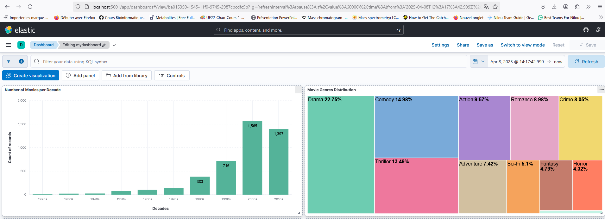
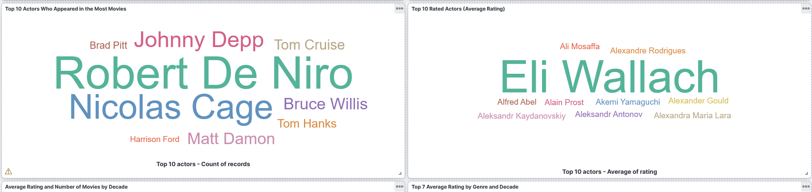
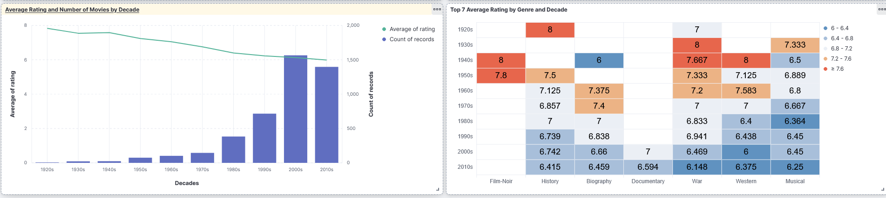
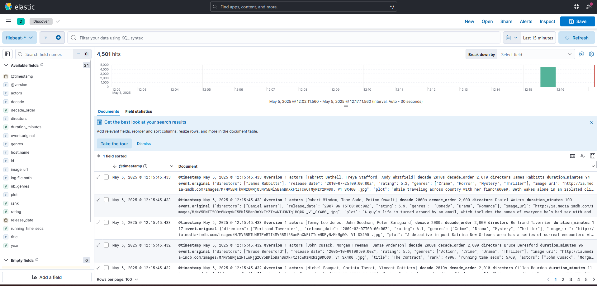
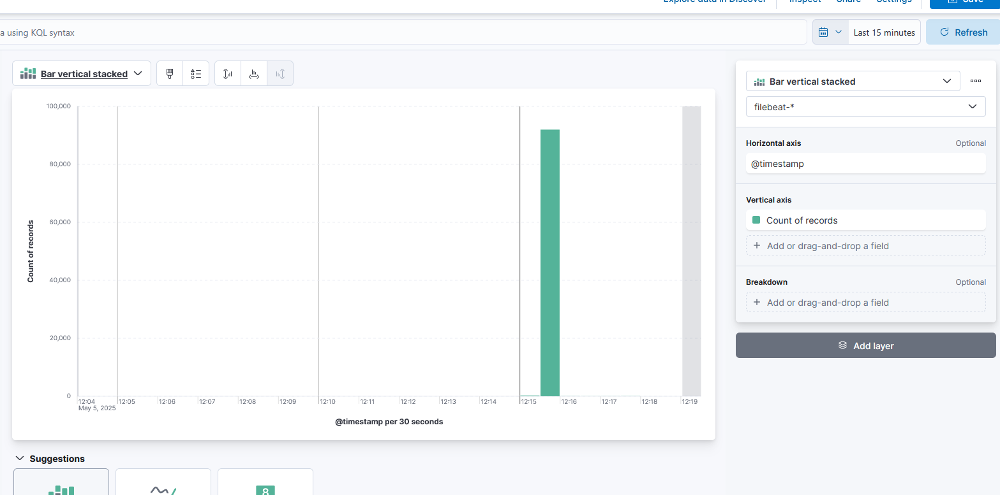

# Rapport de Synthèse : Monitoring et Enrichissement des Données de Films

## Objectif du projet

Mettre en place un pipeline complet d’ingestion, transformation et visualisation de données de films à l’aide de **Logstash**, **Elasticsearch** et **Kibana**, avec enrichissement des données via des filtres personnalisés et création de tableaux de bord interactifs.

---

## Stack technique utilisée

- **Logstash** : ingestion des données et transformation
- **Elasticsearch** : stockage et indexation
- **Kibana** : exploration et visualisation

---

## Pipeline Logstash  

**Fichier utilisé :** `movies_pipeline.conf`

### Filtres appliqués

1. **Ajout du champ `decade`**  
   → Calculé à partir du champ `year` (par exemple: 2013 devient "2010s")

2. **Conversion de la durée**  
   → Transformation de `running_time_secs` en `duration_minutes`

3. **Filtrage des films mal notés**  
   → Suppression de tous les films avec `rating < 5`

4. **Ajout du champ `nb_genres`**  
   → Comptage automatique du nombre de genres pour chaque film

---

## Index Elasticsearch

- **Nom de l’index :** `movies_index`
- **Nombre total de documents indexés :** 4 505
- **Statut :** green

---

## Données indexées dans Kibana

### Vue globale (Discover)

Affichage des documents enrichis avec les champs : `decade`, `duration_minutes`, `nb_genres`, etc.

### Détail d’un document (Vue JSON)

Visualisation d’un document complet avec les transformations appliquées.

---

## Visualisations dans Kibana

### 1.Répartition des films par décennie

- **Type** : Histogramme vertical  
- **Champ** : `decade.keyword`  
- **But** : Montrer l’évolution du nombre de films produits par décennie  

### 2. Distribution des genres de films

- **Type** : Treemap  
- **Champ** : `genres.keyword`  
- **But** : Identifier les genres les plus représentés dans la base de données

---

### 3. Top 10 des acteurs les plus présents

- **Type** : Nuage de mots (Word Cloud)  
- **Champ** : `actors.keyword`  
- **Critère** : Nombre d’apparitions dans des films  

### 4. Top 10 des acteurs les mieux notés

- **Type** : Nuage de mots (Word Cloud)  
- **Champ** : `actors.keyword`  
- **Critère** : Moyenne de la note (`rating`) des films dans lesquels ils ont joué

---

### 5. Note moyenne et volume de films par décennie

- **Type** : Combo Chart (courbe + histogramme)  
- **Champs** : `decade.keyword`, `rating`, `count`  
- **But** : Visualiser la relation entre la quantité et la qualité des films selon les périodes  

### 6. Top 7 des genres les mieux notés par décennie

- **Type** : Heatmap  
- **Champs** : `genres.keyword`, `decade.keyword`, `rating`  
- **But** : Identifier les combinaisons genre/décennie avec les meilleures notes

---

## Interprétation des résultats

- Les champs enrichis (décennie, durée en minutes, nb_genres) facilitent et apportent une nouvelle dimension à l'analyse.
- Le filtrage des films mal notés (< 5) permet d’obtenir des visualisations plus pertinentes.
- Les visualisations combinées (volume + note) permettent de comprendre les tendances de production et de qualité*dans le temps.
- Les genres et les acteurs peuvent être facilement analysés sous plusieurs angles : popularité, qualité, époque.

---

## Filebeat - Visualisation

### 1. Vue Globale

### 2.Événements par minute (Lens)

