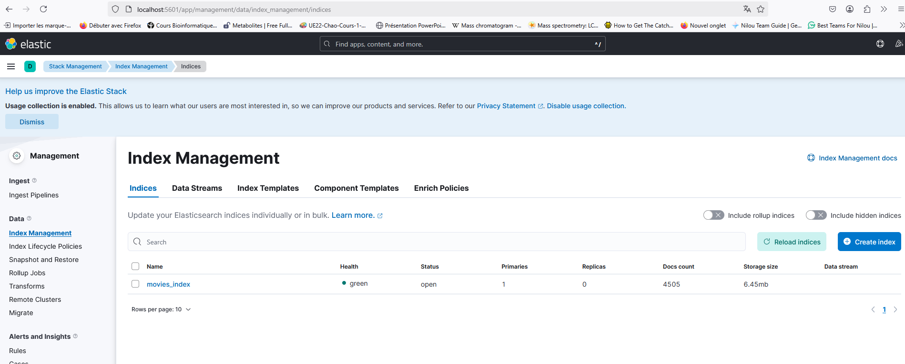
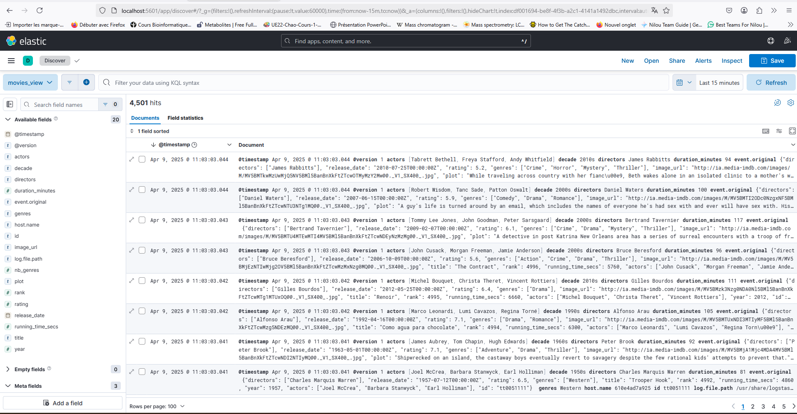
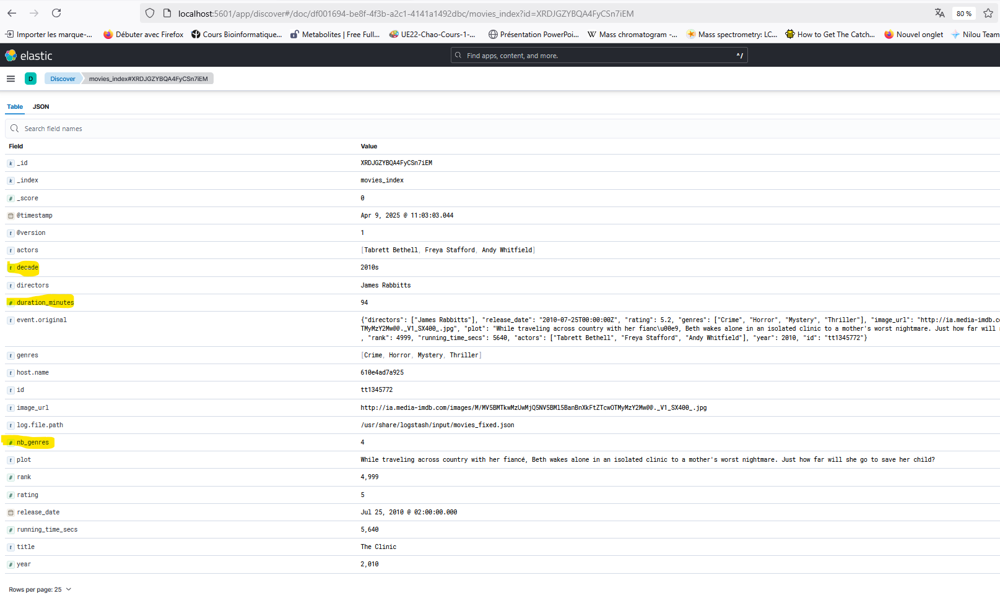

# Rapport de Synthèse : Monitoring et Enrichissement des Données de Films

## Objectif du projet
Mettre en place un pipeline complet d’ingestion, transformation et visualisation de données de films à l’aide de **Logstash**, **Elasticsearch** et **Kibana**, avec enrichissement des données via des filtres personnalisés et création de tableaux de bord interactifs.

---

## Stack technique utilisée
- **Logstash** : ingestion des données et transformation
- **Elasticsearch** : stockage et indexation
- **Kibana** : exploration et visualisation

---

## Pipeline Logstash  
**Fichier utilisé :** `movies_pipeline.conf`

### Filtres appliqués :

1. **Ajout du champ `decade`**  
   → Calculé à partir du champ `year` (ex: 2013 devient "2010s")

2. **Conversion de la durée**  
   → Transformation de `running_time_secs` (secondes) en `duration_minutes` (minutes)

3. **Filtrage des films mal notés**  
   → Suppression de tous les films avec `rating < 5`

4. **Ajout du champ `nb_genres`**  
   → Comptage automatique du nombre de genres pour chaque film

---

## Index Elasticsearch

- **Nom de l’index :** `movies_index`
- **Nombre total de documents indexés :** 4 505
- **Statut :** green

---

## Données indexées dans Kibana

### Vue globale (Discover)
Affichage des documents enrichis avec les champs : `decade`, `duration_minutes`, `nb_genres`, etc.

### Détail d’un document (Vue JSON)
Visualisation d’un document complet avec les transformations appliquées.

---

## Visualisations recommandées dans Kibana

1. **Répartition des films par genre**  
   → Pie chart sur `genres.keyword`

2. **Top 10 des réalisateurs les mieux notés**  
   → Bar chart : moyenne de `rating` groupé par `directors.keyword`

3. **Nombre de films par décennie**  
   → Histogramme sur `decade.keyword`

4. *(Bonus)* : Histogramme `nb_genres` pour voir la diversité des films

---

## Interprétation des résultats

- Les champs enrichis permettent une analyse temporelle, qualitative et thématique.
- Le filtrage améliore la pertinence des données explorées.
- Les visualisations facilitent l’analyse de tendances par genre, réalisateur, ou décennie.

---

## Fichiers importants du projet

- `movies_pipeline.conf` : pipeline Logstash avec filtres
- `movies_fixed.json` : fichier source à ingérer
- `docker-compose.yml` : stack ELK Dockerisée
- Dossier `data/img/` : captures d’écran Kibana

---